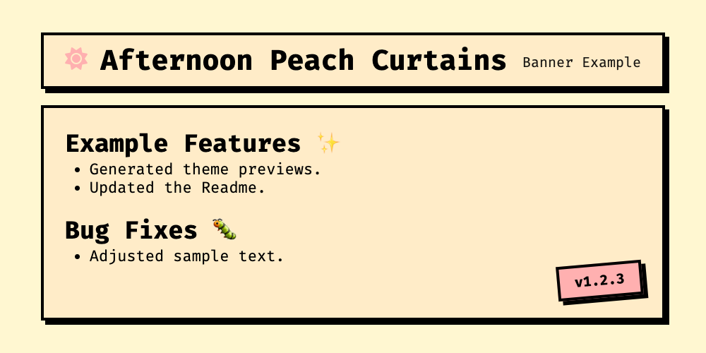

# NEO-BRUTALIST RELEASE BANNER GENERATOR

[](https://github.com/dimmkirr/action-brutalease/actions/workflows/test.yml)
[](https://github.com/dimmkirr/action-brutalease/releases/latest)
[](./LICENSE)

**MAKE YOUR RELEASES BOLD. UNAPOLOGETIC. MEMORABLE.**

Transform your GitHub releases with striking Neo-Brutalist banners that command attention. This action automatically generates visually powerful, design-forward release banners that showcase your changelog in a distinctive aesthetic.


## WHY NEO-BRUTALISM?

Neo-Brutalism is characterized by:
- **Bold, high-contrast colors** that demand attention
- **Strong borders and shadows** that create depth and visual interest
- **Raw, honest presentation** that values function and clarity
- **Distinctive visual language** that stands out in a sea of minimalist design

## WHY THIS ACTION?

- **STAND OUT**: Break through the noise with bold, distinctive release banners
- **COMMUNICATE CLEARLY**: Present your changes with uncompromising clarity
- **AUTOMATE DESIGN**: No design skills needed - the action handles everything
- **CONSISTENT BRANDING**: Maintain a cohesive visual identity across all releases
- **CUSTOMIZABLE**: Adapt colors, logos, and styling to match your project's personality

## THEMES

This action comes with several built-in themes. Here's an example:

**Mist On Old Canvas**


**Afternoon Peach Curtains**



[Explore more themes and customization options](./themes/README.md)

## USAGE

Add this action to your release workflow to automatically generate a Neo-Brutalist banner whenever you publish a new release.

### BASIC EXAMPLE

```yaml
# ...
- name: Generate Banner
  uses: dimmkirr/action-brutalease@v1
  with:
    version: ${{ github.event.release.tag_name }}
    body: ${{ github.event.release.body }}
    repo_url: ${{ github.repository }}
    output: release-banner.png
    project_name: Brutalease
    project_description: Neo-brutalist release banner
    theme: |
      bgOne: '#333333'
      text: '#ffffff'
      accentOne: '#ff5722' # Hex color codes only
      logo: ':fa-brands fa-galactic-republic:' # Logo defined within the theme!
    debug: true
# ...
```

### DOCKER IMAGE

This action uses a pre-built Docker image from GitHub Container Registry (GHCR) for faster execution. The image is automatically built and pushed during the release process.

- Each release creates Docker images with specific version tags (e.g., `v1.0.0`, `v1.1.0`)
- The action automatically uses the correct Docker image version that matches the tag/ref you're using

You can also use the Docker image directly:

```bash
# Replace v1.0.0 with the specific version you want to use
docker pull ghcr.io/dimmkirr/action-brutalease:v1.0.0
```

### VERSION PINNING

When using this action in your workflows, you can pin to a specific version:

```yaml
- name: Generate Banner
  uses: dimmkirr/action-brutalease@v1.0.0  # Pin to specific version
  with:
    # inputs...
```

Or use a major version to automatically get updates within that major version:

```yaml
- name: Generate Banner
  uses: dimmkirr/action-brutalease@v1  # Use latest v1.x.x
  with:
    # inputs...
```

## INPUTS

| Input               | Description                                                                                         | Required | Default   |
|---------------------|-----------------------------------------------------------------------------------------------------|----------|-----------|
| `version`           | Release version                                                                                     | Yes      |           |
| `body`              | Release body text (changelog)                                                                       | Yes      |           |
| `repo_url`          | Repository URL                                                                                      | Yes      |           |
| `project_name`      | Project name (defaults to repository name if not provided)                                          | No       | Repo Name |
| `project_description` | Short description of the project to display under the project name                                  | No       |           |
| `theme`             | YAML string defining theme colors (e.g., `"bgOne: #aabbcc\ntext: #112233"`). Can include `logo` key (emoji, `:fa-...:`, or image path). Missing values use defaults. | No       | Internal Defaults |
| `debug`             | Enable debug mode to save HTML output                                                               | No       | `false`   |
| `strict_style`      | If true, will throw an error when fonts or styles are not available                                 | No       | `true`    |
| `output`            | Output file path                                                                                    | No       | `release.png`|

**Removed**: `logo` input. Now part of `theme` input.

## OUTPUTS

None directly, but generates an image file specified by the `output` input.

## ADVANCED USAGE

### EMBEDDING IN RELEASE NOTES

For maximum impact, embed the banner directly in your release notes:

```yaml
  - name: Update release description with image
    env:
      RELEASE_TAG: ${{ github.event.release.tag_name }}
      IMAGE_URL: https://github.com/${{ github.repository }}/releases/download/${{ github.event.release.tag_name }}/release-banner.png
      GH_TOKEN: ${{ github.token }}
    run: |
      # Get current release body
      RELEASE_BODY=$(gh release view "$RELEASE_TAG" --json body -q .body)

      # Create a temporary file with the new release body
      echo -e "\n\n$RELEASE_BODY" > new_body.md

      # Update the release with the new body
      gh release edit "$RELEASE_TAG" --notes-file new_body.md
```

### USING IN DOCUMENTATION

Reference your Neo-Brutalist banner in documentation or social media:

```markdown

```

### SOCIAL MEDIA SHARING

The generated banners are perfectly sized for sharing on platforms like Twitter, LinkedIn, and Discord to announce your releases.

### CUSTOM THEME EXAMPLE

You can customize the theme by providing a YAML multiline string using the `|` character. Missing values will be merged with the default theme. Here's an example:

```yaml
- name: Generate Banner
  uses: dimmkirr/action-brutalease@v1 # Use your desired version
  with:
    version: ${{ github.ref_name }}
    body: ${{ github.event.release.body }} # Required: Release notes
    repo_url: ${{ github.repositoryUrl }}
    project_description: "My awesome project description" # Optional description
    # Example: Override specific colors using a YAML multiline string
    theme: |
      bgOne: '#333333'
      text: '#ffffff'
      accentOne: '#ff5722' # Hex color codes only
      logo: ':fa-brands fa-galactic-republic:' # Logo defined within the theme!
    # Optionally provide a logo
    # logo: "https://example.com/logo.png"
    output: release-banner.png
```

## CONTRIBUTING

Contributions are welcome! Please feel free to submit a Pull Request.

## LICENSE

This project is licensed under the MIT License - see the LICENSE file for details.

> ![!NOTE]
> This README was written by AI that seems to like Neo Brutalism
