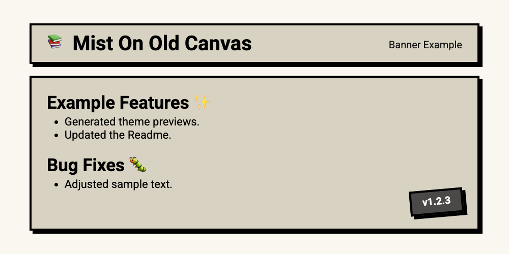
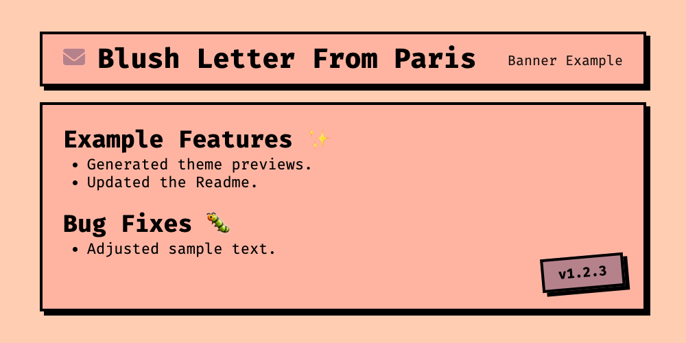

# Theme Previews

<!-- THEME-GALLERY-START -->

## Mist On Old Canvas



```yaml
bgOne: '#faf7f0'
bgTwo: '#d8d2c2'
bgThree: '#b17457'
accentOne: '#4a4947'
accentTwo: '#d8d2c2'
accentThree: '#faf7f0'
text: '#000000'
shadowColor: '#000000'
borderColor: '#000000'
fontFamily: Roboto
```

## Afternoon Peach Curtains


```yaml
bgOne: '#fff7d1'
bgTwo: '#ffecc8'
bgThree: '#ffd09b'
accentOne: '#ffb0b0'
accentTwo: '#ffecc8'
accentThree: '#fff7d1'
text: '#000000'
shadowColor: '#000000'
borderColor: '#000000'
fontFamily: Roboto
```

## Autumn Balcony Reflection


```yaml
bgOne: '#fef9e1'
bgTwo: '#e5d0ac'
bgThree: '#a31d1d'
accentOne: '#6d2323'
accentTwo: '#e5d0ac'
accentThree: '#fef9e1'
text: '#000000'
shadowColor: '#000000'
borderColor: '#000000'
fontFamily: Roboto
```

## Blush Letter From Paris



```yaml
bgOne: '#ffcdb2'
bgTwo: '#ffb4a2'
bgThree: '#e5989b'
accentOne: '#b5828c'
accentTwo: '#ffb4a2'
accentThree: '#ffcdb2'
text: '#000000'
shadowColor: '#000000'
borderColor: '#000000'
fontFamily: Roboto
```

## Velvet Theatre Drape


```yaml
bgOne: '#740938'
bgTwo: '#af1740'
bgThree: '#cc2b52'
accentOne: '#de7c7d'
accentTwo: '#af1740'
accentThree: '#740938'
text: '#FFFFFF'
shadowColor: '#000000'
borderColor: '#000000'
fontFamily: Roboto
```

<!-- THEME-GALLERY-END -->
